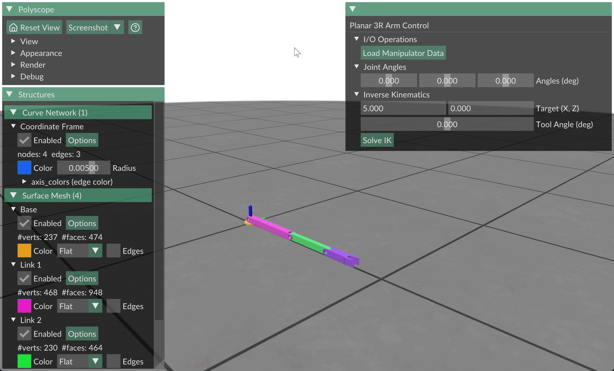

# Polyscope 3DOF Simulation

A Python-based 3D visualisation tool for a 3-degree-of-freedom manipulator. The kinematic modelling conventions are based on Craig's "Introduction to Robotics: Mechanics and Control".



## Dependencies

* Python 3.12
* Polyscope 2.6.1
* NumPy 2.5.0
* Trimesh 4.12.2

## Usage

```bash
git clone https://github.com/edwardmudge/polyscope-3dof-sim.git
cd polyscope-3dof-sim
pip install -r requirements.txt
python main.py
```
